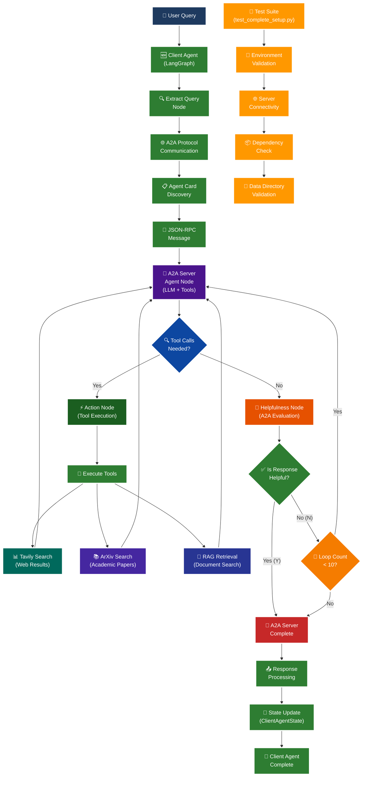

# 🚀 A2A LangGraph Development Diagram

## 📊 Complete System Architecture

This diagram shows the original A2A protocol implementation (blue/purple nodes) plus my new development work (green nodes) that demonstrates agent-to-agent communication.

## 🎨 Color Legend

- **🔵 Blue/Purple Nodes**: Original A2A protocol implementation (from README)
- **🟢 Green Nodes**: NEW DEVELOPMENT WORK - Activity #1 (LangGraph client agent)
- **🟠 Orange Nodes**: NEW DEVELOPMENT WORK - Testing infrastructure

## 🆕 New Development Components

### **🟢 Activity #1: LangGraph Client Agent**
- **Client Agent**: LangGraph agent that communicates with A2A server
- **Extract Query Node**: Processes user input for A2A communication
- **A2A Protocol Communication**: Standardized agent-to-agent messaging
- **Agent Card Discovery**: Automatic capability discovery
- **JSON-RPC Message**: Structured communication format
- **Response Processing**: Handles A2A server responses
- **State Update**: Manages conversation state
- **Client Agent Complete**: Final output delivery

### **🟠 Testing Infrastructure**
- **Test Suite**: Comprehensive validation system
- **Environment Validation**: API key and configuration checks
- **Server Connectivity**: A2A server availability testing
- **Dependency Check**: Package and library verification
- **Data Directory Validation**: RAG document availability

## 🔄 Integration Points

The new development work integrates with the original A2A protocol at key points:
1. **Client Agent → A2A Server**: Direct communication via JSON-RPC
2. **Agent Card Discovery**: Automatic capability detection
3. **Response Processing**: Seamless integration with existing workflow
4. **Testing Validation**: Comprehensive system verification

This diagram demonstrates how my Activity #1 implementation extends the original A2A protocol to enable agent-to-agent communication while maintaining the core helpfulness evaluation loop.
