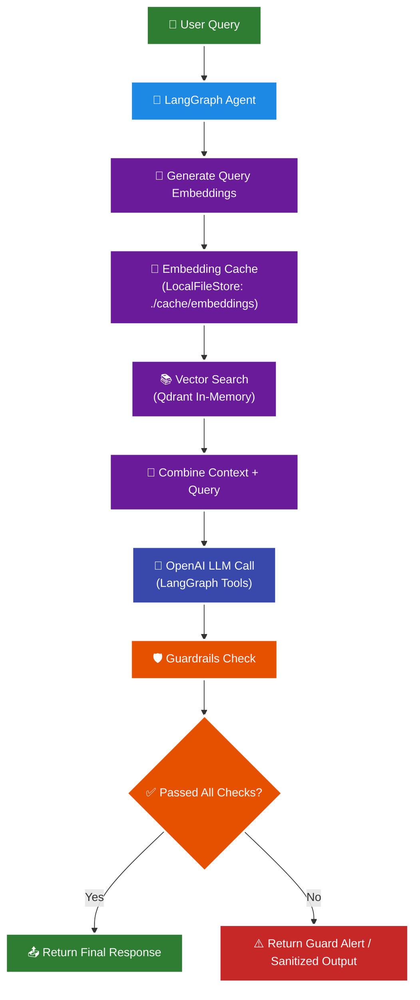

## 📊 Production RAG with Cashing + Guardrails Pipeline

This diagram shows how a user query flows through retrieval, caching, generation, and safety checks in this project.
- **Embedding cache**: persisted under `./cache/embeddings`.
- **LLM cache**: configurable in memory or SQLite via `setup_llm_cache(...)`.
- **Guardrails**: post-generation validation before returning a response.

## 📊 Production RAG + Guardrails Pipeline (Implemented Flow)

### Implementation notes

- **Embedding caching**: `langgraph_agent_lib/caching.py` → `CacheBackedEmbeddings` uses `LocalFileStore` under `./cache/embeddings` and namespaces by model hash.
- **LLM caching**: `langgraph_agent_lib/caching.py` → `setup_llm_cache("memory"|"sqlite", cache_path)`; SQLite default is `./cache/llm_cache.db`.
- **Model config**: `langgraph_agent_lib/models.py` → `get_openai_model(...)` (defaults to `gpt-4.1-mini`).
- **Performance tests**: `cache_performance_test.py` and `activity1_cache_testing_notebook.py` measure speedup and hit rates for embeddings, LLM, and end-to-end RAG.